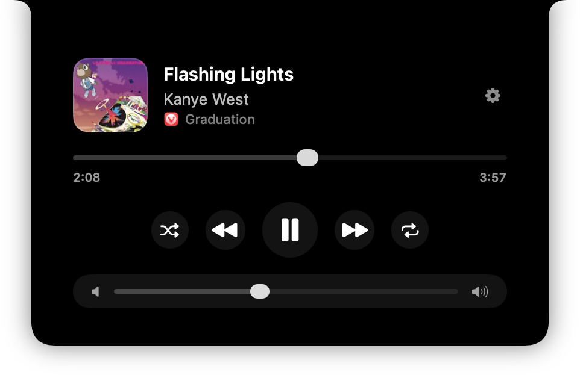
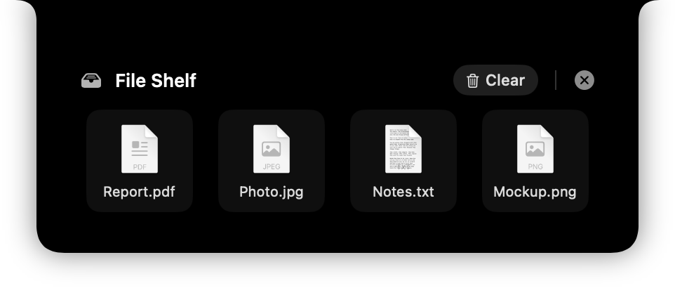

<div align="center">

# 🎵 MacNotchPlayer

**Turn the MacBook notch into a Liquid Glass media player.**

Hover the notch — a player slides out with the currently playing track from
*any* app (Apple Music, Spotify, browsers, …), playback controls, a scrubber,
and a two-finger-swipe file shelf.

[-blue?logo=apple&logoColor=white)](#requirements)
[](Package.swift)
[](Sources/MacNotchPlayer)
[](LICENSE)
[](https://github.com/metraakladap/MacNotchAudioPlayer/stargazers)

<table>
  <tr>
    <td align="center"><br><sub><b>Player</b> — Liquid Glass, album-colored controls</sub></td>
    <td align="center"><br><sub><b>File Shelf</b> — two-finger swipe, drag files in &amp; out</sub></td>
  </tr>
</table>

</div>

## ✨ Features

- 🧊 **Liquid Glass UI** (macOS 26): glass transport buttons, glass volume pill,
  continuous-rounded surfaces; sliders stay neutral.
- 🎨 **Album-colored buttons** (optional): transport buttons take a color sampled
  from the artwork, applied immediately on hover. Toggle in Settings.
- ⏯️ **Transport**: play/pause, next, previous, **shuffle**, **repeat** (cycles
  off → track → playlist).
- 🎚️ **Scrubber** with seek; tap the right time to toggle remaining/total.
- 🔊 **System volume** slider (responsive drag, throttled apply).
- 📱 **Compact indicator**: album-art thumbnail + animated equalizer beside the
  notch while playing (Dynamic-Island style).
- 👀 **Auto-peek**: a compact **mini** card (art + title + artist only) briefly
  slides out when the track changes; hovering expands it to the full player.
- 🗂️ **File Shelf**: swipe across the notch with two fingers to open a pinned
  drop tray — drag files in, they stay attached (persisted across restarts),
  drag them out later into Finder or any app. Swipe again to flip back to the
  player; ✕ closes the shelf.
- 🖱️ **Source-app icon**; click the artwork to open the playing app.
- 📜 **Marquee** scrolling for long titles.
- 🌐 **English / Ukrainian** UI, switchable live.
- ⚙️ **Settings**: a gear button in the player (and ⌘, from the menu) opens a
  window to pick the language and toggle every behavior + Launch-at-Login.

## 📋 Requirements

- MacBook with a notch (it also runs on external displays, docked)
- **macOS 26 (Tahoe)** — required for the Liquid Glass design

## 📦 Install

### Build from source

```bash
git clone https://github.com/metraakladap/MacNotchAudioPlayer.git
cd MacNotchAudioPlayer
./scripts/build_app.sh   # compile, assemble build/MacNotchPlayer.app, codesign
./scripts/install.sh     # copy to /Applications and launch
```

To produce a drag-to-/Applications disk image instead:

```bash
./scripts/make_dmg.sh    # → build/MacNotchPlayer.dmg
```

Override the signing identity with `SIGN_ID="…" ./scripts/build_app.sh`.

## 🚀 Usage

After install, a `♫` icon appears in the menu bar and the app auto-starts at
login. **Hover the notch** to reveal the player. The menu offers play/pause,
next/previous, a Launch-at-Login toggle, and Quit.

## 🔧 How it works

- **System-wide now playing** is read via [`mediaremote-adapter`](https://github.com/ungive/mediaremote-adapter)
  (BSD-3). On macOS 15.4+/26 Apple locked the private MediaRemote framework for
  un-entitled apps; the adapter works around this by running a bundled Perl
  script through `/usr/bin/perl` (an Apple-entitled binary) that loads a helper
  framework and streams JSON updates. No SIP changes, no special entitlements.
- **The notch UI / animation** uses [`DynamicNotchKit`](https://github.com/MrKai77/DynamicNotchKit)
  (MIT), vendored under `vendor/`. The notch lives in an invisible *compact*
  state; hovering it (`isHovering`) drives the `expand()` transition.

## 🗂 Project layout

```
Sources/MacNotchPlayer/
  App.swift                 # @main, MenuBarExtra, SMAppService login item
  NowPlayingController.swift # perl stream + parse + seek/send commands
  NotchController.swift      # DynamicNotch + hover → expand/compact
  PlayerView.swift           # SwiftUI player (artwork, controls, scrubber)
  Models.swift               # NowPlaying model + JSON merge/parse
Resources/                   # bundled mediaremote-adapter.pl + framework
vendor/                      # mediaremote-adapter source, DynamicNotchKit
scripts/                     # build_app.sh, make_dmg.sh, install.sh
```

## 📄 License

MacNotchPlayer is released under the [MIT License](LICENSE).

Bundled third-party components:

- [MediaRemoteAdapter](https://github.com/ungive/mediaremote-adapter) © 2025 Jonas van den Berg — BSD 3-Clause
- [DynamicNotchKit](https://github.com/MrKai77/DynamicNotchKit) © Kai Azim — MIT
